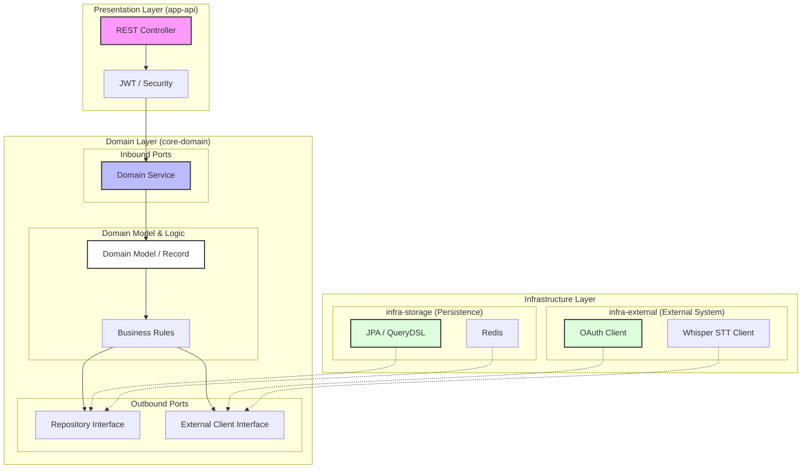

# 📔 Mobidic (모바일 영어 단어장 서비스)

**사용자 맞춤형 단어 학습 및 AI 기반 발음 체크 플랫폼**

> * 이 레포지토리는 포트폴리오 제출 용도로, 실제 운영되고 있는 서비스의 일부만 포함되어 있습니다.

---

## 📝 프로젝트 소개 (Project Introduction)

**"당신의 손안에 있는 스마트한 영어 학습 파트너, Mobidic"**

Mobidic은 기존 단어장 서비스들의 불편함을 해소하고, 사용자에게 최적화된 학습 경험을 제공하기 위해 탄생했습니다. 단순 암기를 넘어 **Whisper STT AI**를 활용한 입체적인 발음 교정 학습을
지원하며, **헥사고날 아키텍처** 기반의 견고한 백엔드 시스템을 지향합니다.

### 🔗 Quick Links

| 항목              |                                                                                          Link                                                                                          | 상세 설명                     |
|:----------------|:--------------------------------------------------------------------------------------------------------------------------------------------------------------------------------------:|:--------------------------|
| **Google Play** |  | 모바일 앱 정식 출시 및 서비스 중       |
| **Swagger UI**  |                             | 백엔드 API 실시간 명세서 (Swagger) |

---

## 📝 패치 노트 (Patch Notes)

### **v1.11.0 (2026.06.04)**

- **Refactor**: 백엔드 멀티모듈 구조 개편 (`api`, `domain`, `storage`, `external`, `common`)
- **Arch**: 의존성 역전 원칙(DIP)을 적용하여 도메인 모듈의 인프라 종속성 제거 (`storage -> domain`)
- **Build**: 루트 `build.gradle` 설정을 통한 모듈 간 중복 의존성 관리 및 빌드 최적화

---

## 📅 개발 정보 (Development Info)

### **개발 기간**

- **2024.04 - 현재** (지속적인 유지보수 및 고도화, 운영 진행 중)
    - **1차_Foundation (2024.04 - 2024.07)**
        - 안드로이드 MVVM 아키텍처 네이티브 앱 및 백엔드 API 개발 및 테스트
    - **2차_Expansion (2025.03 - 2025.06)**
        - 플러터 크로스플랫폼 앱 개발 및 각종 및 발음체크 기능 추가 구현 및 배포
    - **3차_Optimization (2026.02 - 2026.04)**
        - 플러터 아키텍처 개편
        - 백엔드 리팩토링 및 쿼리 성능 개선
        - 프리셋 기능 및 소셜 인증 구현
    - **4차_Modernization (2026.05 - 현재)**
        - 모놀리식에서 실무형 헥사고날 아키텍처로의 전환 및 멀티 모듈 구조 확립
        - 도메인 중심 설계(DDD)와 Java Record를 활용한 불변 모델링 적용
        - 의존성 역전 원칙(DIP)을 통한 인프라 종속성 제거 및 코드 순수성 강화

### **개발 환경**

- **Backend**: Java 21, Spring Boot 3.5.14, Spring Data JPA, Spring Security, QueryDSL
- **Frontend**: Flutter (iOS/Android), Android Native Legacy (MVVM)
- **Database & Cache**: MySQL, Redis
- **Model Serving**: Python (Flask, Gunicorn), Whisper STT
- **Deployment**: Docker, Ubuntu 24.04 LTS, NGINX
- **Library & Tools**: JJWT, Git

### **멤버 구성**

- **KTH (1인 개발)**: 기획, 디자인, 백엔드 API 설계/구현, 앱(Android/Flutter) 개발, 서버 인프라 관리

---

## ✨ 주요 기능 (Key Features)

- 📚 **사용자 맞춤형 단어장**: 나만의 단어장 생성, 편집 및 프리셋 단어장 복사
- 🎙️ **Whisper STT 발음 체크**: AI 음성 인식을 통한 발음 유사도 분석 및 피드백
- 🎮 **인터랙티브 퀴즈**: OX, 빈칸 채우기 등 다양한 학습 모드 (어뷰징 방지 토큰 적용)
- 🧲 **자석 모드 FAB**: 사용자 드래그에 반응하는 지능형 Floating Action Button
- 📊 **학습 통계**: 사용자별 학습 현황 및 퀴즈 결과에 대한 시각화 데이터 제공
- 🔑 **소셜 로그인**: 카카오 OAuth2를 통한 간편 가입 및 로그인

---

## 🏗 아키텍처 (Architecture)

### **1. Hexagonal Architecture (Ports and Adapters)**

모든 의존성은 외부에서 도메인 내부로 향하며, 핵심 비즈니스 로직은 인프라 기술에 의존하지 않습니다.

### **2. Module Specifications**

| 모듈                 | 역할                   | 핵심 기술                       |
|:-------------------|:---------------------|:----------------------------|
| **app-api**        | 애플리케이션 진입점 및 응답 처리   | Spring MVC, Spring Security |
| **core-domain**    | 핵심 비즈니스 로직 및 도메인 모델  | Pure Java, Java Records     |
| **infra-storage**  | 데이터 영속성 관리 및 데이터 액세스 | JPA, QueryDSL, Redis        |
| **infra-external** | 외부 시스템 및 서드파티 API 연동 | RestClient, OAuth           |
| **core-common**    | 공통 상수, 예외 규격 및 유틸리티  | Java                        |

---

## 🚀 핵심 문제 해결 (Key Problem Solving)

### **1. 도메인 순수성 및 캡슐화 강화 (Lombok Removal)**

- **문제 상황**: Lombok 어노테이션 과다 사용으로 인한 객체 생성 규칙 모호성 및 로직 파편화
- **해결 방안**:
    - 명시적인 **정적 팩토리 메서드**를 통한 객체 생성 규칙 강제
    - **Java Record** 도입으로 불변성(Immutability) 보장 및 보일러플레이트 제거
- **결과**: 도메인 로직의 응집도가 높아지고 단위 테스트 작성이 용이해짐

### **2. 유연한 인프라 전략: Infrastructure Fallback**

- **문제 상황**: 캐시(Redis) 장애 발생 시 전체 서비스 가용성 저하 리스크
- **해결 방안**:
    - Redis 장애 감지 시 자동으로 메인 DB로 전환되는 **Fallback 메커니즘** 설계
    - 인터페이스(Port) 추상화를 통해 도메인 로직 수정 없이 어댑터 수준에서 대응
- **결과**: 인프라 장애 시에도 핵심 기능이 중단되지 않는 고가용성 확보

### **3. 성능 최적화: 쿼리 2N+1 문제 해결**

- **문제 상황**: 대량 데이터 복사 및 통계 연산 시 발생하는 쿼리 폭증 현상
- **해결 방안**:
    - **QueryDSL DTO Projection**으로 복잡한 통계 연산을 단일 쿼리로 최적화
    - **Hibernate Batch Size** 설정을 통한 연관 엔티티 조회 최적화
- **결과**: 네트워크 오버헤드 제거 및 데이터 처리 속도 대폭 개선

### **4. 퀴즈 시스템 설계: 어뷰징 방지 및 기밀성 보장**

- **문제 상황**: 통계에 반영되는 퀴즈 점수에 대한 어뷰징 방지 및 로직 결합도 분리 필요
- **해결 방안**:
    - **UUID 기반 일회용 토큰**을 생성하여 Redis에 정답과 함께 저장
    - **Simple Factory Method 패턴** 적용으로 퀴즈 유형 추가 시 확장성 확보
- **결과**: 퀴즈 데이터의 보안성을 강화하고 신규 유형 추가 시 기존 코드 수정 최소화

---

## ✅ 테스팅 전략 (Testing Strategy)

### **1. 계층별 검증 (Layered Verification)**

- **Domain Unit Test**: Mockito를 활용하여 외부 의존성 없이 도메인 비즈니스 로직을 고속 검증합니다.
- **Infrastructure Integration Test**: **Testcontainers**를 통해 실제 Docker 환경(MySQL, Redis)에서 정합성을 확인합니다.

### **2. 효율화 및 독립성 보장**

- **UUID 기반 고속 테스트**: 모든 엔티티가 UUID를 사용하므로, 별도의 초기화 없이 `@Transactional` 롤백만으로 완벽한 격리와 성능을 보장합니다.
- **Edge Case 검증**: 인프라 장애(Fallback), 어뷰징 시나리오 등 다양한 예외 상황에 대한 커버리지를 확보합니다.