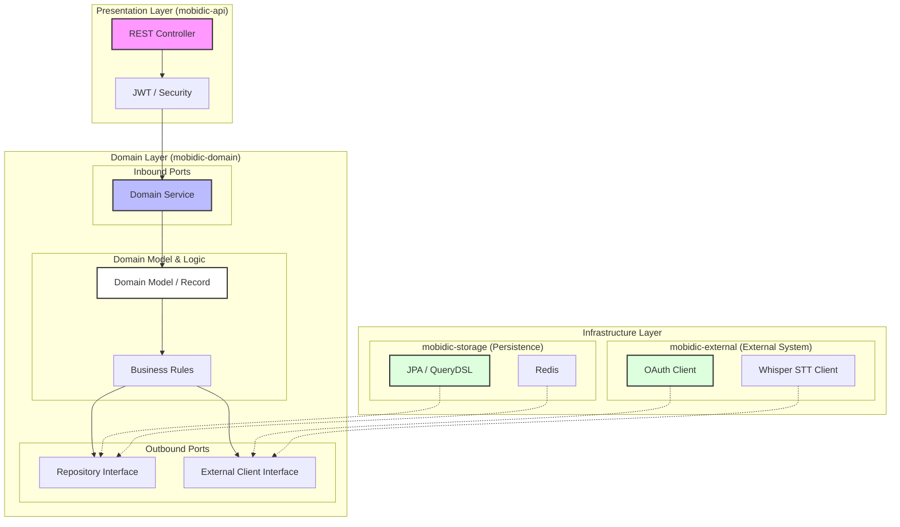

# 📔 Mobidic (모바일 영어 단어장 서비스)

> **사용자 맞춤형 단어 학습 및 딥러닝 기반 발음 체크 기능을 제공**

---

## 📝 프로젝트 소개 (Project Introduction)
기존 단어장 서비스의 불편함을 개선하고자 설계되었습니다. 네이티브 안드로이드에서 플러터 크로스 플랫폼으로의 전환, 그리고 백엔드 최적화 및 헥사고날 아키텍처 도입을 거치며 완성도를 높인 프로젝트입니다. 사용자별 맞춤형 단어장 제공과 더불어 Whisper STT를 활용한 인공지능 기반 발음 교정 기능을 핵심 서비스로 제공합니다.

현재 구글 플레이스토어에 정식 출시되어 서비스 중입니다.
 

---

## 📝 패치 노트 (Patch Notes)

### **v1.11.0 (2026.06.04)**

- **Refactor**: 백엔드 멀티모듈 구조 개편 (`api`, `domain`, `storage`, `external`, `common`)
    - **Arch**: 의존성 역전 원칙(DIP)을 적용하여 도메인 모듈의 인프라 종속성 제거 (`storage -> domain`)
    - **Build**: 루트 `build.gradle` 설정을 통한 모듈 간 중복 의존성 관리 및 빌드 최적화

### **v1.10.4 (2026.05.11)**

- **Feature**: 사용자가 직접 위치를 이동할 수 있는 **자석 모드 FAB** 도입 (단어장/단어 목록 페이지)
    - **Bug Fix**: 비회원 모드 이용 후 로그인 시, 기능 잠김(Locked) 상태가 해제되지 않던 데이터 동기화 오류 수정
    - **Internal**: `AuthViewModel` 상태 관리 로직 최적화 및 앱 버전 업데이트 (`1.10.4+13`)

---

## 📅 개발 기간 (Development Period)

- **2024.04 - 현재** (지속적인 유지보수 및 기능 고도화 진행 중)
    - Phase 1 (2024.04 - 2024.07): Foundation
    - Phase 2 (2025.03 - 2025.06): Expansion
    - Phase 3 (2026.02 - 현재): Optimization & Modernization

---

## 🛠 개발 환경 (Development Environment)

- **Backend:** Java 21, Spring Boot 3.4.3, Spring Data JPA, Spring Security, QueryDSL
    - **Frontend:** Flutter (iOS/Android), Android Native Legacy (MVVM)
    - **Database & Cache:** MySQL, Redis
    - **Model Serving:** Python (Flask, Gunicorn), Whisper STT
    - **Library & Tools:** JJWT, Docker, Git

---

## 👥 멤버 구성 (Member Composition)

- **KTH (1인 개발)**: 기획, 디자인, 백엔드 API 설계/구현, 프론트엔드(Android/Flutter) 앱 개발, 서버 인프라 관리

---

## ✨ 주요 기능 (Key Features)

- **사용자 맞춤형 단어장**: 나만의 단어장 생성, 편집 및 프리셋 단어장 복사 기능
    - **Whisper STT 발음 체크**: 사용자의 발음을 인식하여 정답 단어와의 유사도를 분석하고 점수 산출
    - **인터랙티브 퀴즈**: OX 퀴즈, 빈칸 채우기 등 다양한 형태의 단어 학습 퀴즈 제공 (어뷰징 방지 토큰 적용)
    - **자석 모드 FAB**: 조작 편의성을 극대화한 사용자 드래그 가능 Floating Action Button
    - **학습 통계**: 사용자별 단어 학습 현황 및 퀴즈 결과에 대한 시각화된 통계 정보 제공
    - **소셜 로그인**: 카카오 OAuth2를 통한 간편 가입 및 로그인 기능

---

## 🏗 아키텍처 (Architecture)

### 1. Hexagonal Architecture (Ports and Adapters)

모든 의존성은 외부에서 도메인 내부로 향하며, 핵심 비즈니스 로직은 인프라 기술(JPA, Redis 등)에 의존하지 않습니다.

### 2. Module Specifications

| 모듈                   | 역할                   | 핵심 기술                       |
|:---------------------|:---------------------|:----------------------------|
| **mobidic-api**      | 애플리케이션 진입점 및 응답 처리   | Spring MVC, Spring Security |
| **mobidic-domain**   | 핵심 비즈니스 로직 및 도메인 모델  | Pure Java, Java Records     |
| **mobidic-storage**  | 데이터 영속성 관리 및 데이터 액세스 | JPA, QueryDSL, Redis        |
| **mobidic-external** | 외부 시스템 및 서드파티 API 연동 | RestClient, OAuth           |
| **mobidic-common**   | 공통 상수, 예외 규격 및 유틸리티  | Java                        |

---

## 🚀 핵심 문제 해결 (Key Problem Solving)

### 1. 도메인 순수성 및 캡슐화 강화 (Lombok Removal)

- **문제 상황:** Lombok 어노테이션 과다 사용으로 인해 객체 생성 규칙이 모호해지고, 도메인 로직이 엔티티 외부로 분산되는 문제 발생
    - **해결 방안:**
        - **Lombok 제거**: 명시적인 생성자와 정적 팩토리 메서드를 통해 객체 생성 규칙을 강제
        - **Java Record 활용**: DTO 및 일부 도메인 모델에 `record`를 도입하여 불변성(Immutability) 보장 및 보일러플레이트 코드 제거
    - **결과:** 코드의 가독성과 유지보수성이 향상되었으며, 도메인 로직에 대한 단위 테스트가 용이해짐

### 2. 유연한 인프라 전략: Infrastructure Fallback

- **문제 상황:** 캐시(Redis) 장애 발생 시 전체 서비스의 가용성이 저하될 수 있는 리스크 존재
    - **해결 방안:**
        - Redis 장애를 감지하여 자동으로 메인 DB로 전환되는 **Fallback 메커니즘** 설계
        - 인터페이스(Port)를 통한 추상화로 도메인 로직 변경 없이 어댑터 수준에서 대응
    - **결과:** 인프라 장애 상황에서도 핵심 기능이 중단되지 않는 높은 가용성 확보

### 3. 성능 최적화: 쿼리 2N+1 문제 해결

- **문제 상황:** 사용자 최초 가입 시 Preset 단어장 복사 및 학습 통계 연산 과정에서 데이터 양($N$)에 비례하여 쿼리가 $2N+1$번 발생하는 성능 저하 확인
    - **해결 방안:**
        - **QueryDSL & DTO Projection:** 복잡한 통계 연산 쿼리를 단일 쿼리로 최적화하여 연산 효율 극대화
        - **Hibernate Batch Size:** 엔티티 간 단방향 매핑 구조를 유지하면서, Preset 복사 시 발생하는 연관 엔티티 조회를 **Batch Size 설정**을 통해 1번의 쿼리로 단축
    - **결과:** 불필요한 네트워크 오버헤드를 제거하여 데이터 로딩 및 처리 속도 대폭 개선

### 4. 퀴즈 시스템 설계: 어뷰징 방지 및 기밀성 보장

- **문제 상황:** 통계에 반영되는 퀴즈 점수에 대한 어뷰징을 방지하고, 퀴즈 생성-채점 로직 간의 결합도를 낮춰야 함
    - **해결 방안:**
        - **Token 기반 채점:** **UUID 기반의 일회용 토큰**을 생성하여 Redis에 정답과 함께 저장
        - **결합도 분리:** 클라이언트 응답에는 정답을 제외한 토큰과 문제 정보만 포함하여 채점 로직과의 기밀성 유지
        - **Simple Factory Method 패턴:** OX 퀴즈, 빈칸 채우기 등 다양한 퀴즈 형태에 유연하게 대응할 수 있도록 설계
    - **결과:** 퀴즈 데이터의 보안성을 강화하고 새로운 퀴즈 유형 추가 시 기존 코드 수정 최소화

---

## ✅ 테스팅 전략 (Testing Strategy)

서비스의 안정성과 신뢰성을 확보하기 위해 계층별로 차별화된 검증 전략을 채택하고 있습니다.

### 1. 계층별 검증 (Layered Verification)
- **Domain Unit Test**: 외부 환경(DB, Redis 등)에 의존하지 않고 Mockito를 활용하여 도메인 비즈니스 로직을 고속으로 검증합니다.
- **Infrastructure Integration Test**: **Testcontainers**를 활용하여 실제와 동일한 Docker 환경(MySQL, Redis)에서 영속성 계층 및 외부 시스템 연동의 정합성을 확인합니다.

### 2. 테스트 효율화 및 독립성 보장
- **UUID 기반 고속 테스트**: 모든 엔티티가 UUID를 식별자로 사용하므로, 별도의 ID 초기화 과정 없이 `@Transactional` 롤백만으로도 완벽한 테스트 격리와 높은 성능을 보장합니다.
- **Edge Case 검증**: 주요 비즈니스 경로뿐만 아니라 인프라 장애(Fallback), 어뷰징 시도 등 다양한 예외 상황에 대한 테스트 커버리지를 확보하여 견고한 시스템을 유지합니다.

